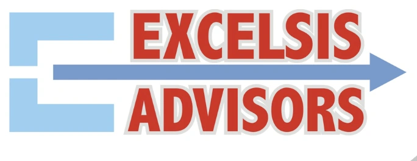

# ExcelsisAdvisors Web Audit Portal — Comprehensive Quality, Accessibility, Performance & Architectural Audit Report

**Target Project**: ExcelsisAdvisors Smart Audit Portal (`index.html` & associated assets)  
**Root Path**: `/Users/ronit/Downloads/ExcelsisAdvisors-main`  
**Date of Audit**: August 13, 2026  
**Auditor Team**: Teamwork Comprehensive Audit Specialist Panel  
**Target Specification**: WCAG 2.1 AA Compliance, HTML5 Semantics, Modular CSS Architecture, JS Performance, Responsive UX, and SEO Optimization  

---

## 1. Executive Summary & Project Overview

An end-to-end audit was conducted on the ExcelsisAdvisors web application codebase (`/Users/ronit/Downloads/ExcelsisAdvisors-main/index.html`, 3,001 lines, ~210 KB). The application is a client-side Single Page Application (SPA) designed for real-time school campus compliance auditing, risk calculation, draft management, and PDF report generation. It is implemented using vanilla HTML5, Tailwind CSS, JavaScript (ES6+), IndexedDB, and LocalStorage.

While the application features a visual presentation with dark mode support, score calculation indicators, and client-side draft management, the technical audit revealed critical defects across **accessibility (WCAG 2.1 AA non-compliance)**, **CSS architecture**, **mobile responsiveness**, **JavaScript performance**, **security**, and **SEO metadata infrastructure**.

### Key Highlights of Audit Findings:
1. **HTML Semantic Structure & WCAG 2.1 AA Accessibility**: Complete absence of an `<h1>` document heading, over 150 unlabeled `<textarea>` input controls across 50+ compliance cards lacking bound `<label for="...">` elements, zero `<form>` container elements, modal overlays (`#login-overlay` and `#pdf-modal-overlay`) lacking `role="dialog"`, `aria-modal="true"`, focus trapping, or Escape key listeners, icon-only buttons missing `aria-label`s, dynamic image previews lacking `alt` attributes, and low-contrast slate micro-typography (`text-[9px] text-slate-400`).
2. **CSS Architecture & Design Tokens**: Monolithic 210 KB single-file structure with styles embedded in `<style>` blocks and inline Tailwind classes, reliance on Tailwind CSS Play CDN (`cdn.tailwindcss.com`) which is marked by Tailwind as unsafe for production, invalid Tailwind color utility classes (`bg-slate-955/85`), absence of `:root` CSS custom properties, and overuse of `!important` flags in hover utility rules.
3. **Mobile Responsiveness & Viewport UX**: On screens under 1024px, the desktop sidebar renders at full width above main content, forcing mobile users to scroll through 800+ pixels of controls before reaching audit cards. Modal dialog containers lack `overflow-y-auto` and vertical viewport bounds (`max-h-[90vh]`), cutting off submit and cancel buttons when software touch keyboards open. Compliance rating buttons and category pills suffer from cramped touch targets (<44px).
4. **JavaScript Performance, DOM Efficiency & Security**: `saveState()` executes synchronously on **every single textarea `oninput` keystroke**, serializing the entire multi-megabyte application state tree (including Base64 photographic evidence strings) to IndexedDB/LocalStorage. Search filtering destroys and rebuilds the entire DOM card grid via `innerHTML` teardown. Plaintext auditor passwords are stored in global client-side objects (`AUDITOR_LOGINS`).
5. **SEO, Social Graph & Assets**: Missing Canonical URL, OpenGraph (OG) meta tags, Twitter Cards, Robots directives, Theme-color, and Schema.org JSON-LD structured data. Favicon implementation consists of a single `favicon.png` file without Apple touch icons or Web Manifest (`site.webmanifest`).

---

## 2. Summary of Categorized Findings Table

| Finding ID | Priority | Category | Finding Title / Summary | Applicable Standard | Target Location |
|---|---|---|---|---|---|
| **AUD-HTML-H1** | **High** | HTML / WCAG | Completely Missing `<h1>` Document Heading | WCAG 1.3.1 (A), 2.4.6 (AA) | `index.html:183-477` |
| **AUD-HTML-H2** | **High** | HTML / WCAG | Unbound Form Labels & Missing `id`/`for` Attributes on Controls | WCAG 1.3.1 (A), 4.1.2 (A) | `index.html:439, 508, 1647` |
| **AUD-HTML-H3** | **High** | HTML / WCAG | Complete Absence of `<form>` Container Elements | WCAG 1.3.1 (A), 3.2.2 (A) | `index.html:180, 280, 435` |
| **AUD-HTML-H4** | **High** | HTML / WCAG | Modals Missing ARIA Dialog Roles, Focus Trapping & Escape Handlers | WCAG 2.1.1 (A), 2.4.3 (A) | `index.html:180, 475` |
| **AUD-HTML-H5** | **High** | HTML / WCAG | Icon-Only Buttons Lacking Accessible Names (`aria-label`) | WCAG 4.1.2 (A), 1.1.1 (A) | `index.html:231, 440, 1229` |
| **AUD-HTML-H6** | **High** | HTML / WCAG | Dynamically Rendered Card Preview Images Missing `alt` Text | WCAG 1.1.1 (A) | `index.html:1695, 2075` |
| **AUD-CSS-H1** | **High** | CSS Architecture | Monolithic Embedded Single-File CSS Structure | Code Quality & Caching | `index.html:43-166` |
| **AUD-CSS-H2** | **High** | CSS / Performance | Production Use of Development Tailwind Play CDN & Invalid Utilities | Performance / CSS Spec | `index.html:15, 177, 474` |
| **AUD-MOB-H1** | **High** | Mobile UX | Mobile Viewport Sidebar Hierarchy & 800px+ Initial Scroll | Responsive Design / UX | `index.html:215, 218` |
| **AUD-MOB-H2** | **High** | Mobile UX | Modal Dialog Overlays Lack Vertical Scrollability on Mobile | Mobile UX / Accessibility | `index.html:177, 473` |
| **AUD-JS-H1** | **High** | JS Performance | Undebounced Storage Serialization on Every Input Keystroke | Performance / Input Lag | `index.html:967, 1162` |
| **AUD-JS-H2** | **High** | Architecture | Monolithic Single-File JavaScript Architecture (2,466 Inline JS Lines) | Code Quality / Modularity | `index.html:532-2998` |
| **AUD-JS-H3** | **High** | Security | Plaintext Auditor Passwords & Insecure Client-Side Authentication | Security / Access Control | `index.html:605-611` |
| **AUD-HTML-M1** | **Medium** | HTML / WCAG | Broken Heading Progression (Sub-labels Styled as `<h2>`) | WCAG 1.3.1 (A), 2.4.6 (AA) | `index.html:278, 312, 327` |
| **AUD-HTML-M2** | **Medium** | HTML / WCAG | Missing Skip-to-Main-Content Navigation Link | WCAG 2.4.1 (A) | `index.html:175` |
| **AUD-HTML-M3** | **Medium** | HTML / WCAG | Multiple `<nav>` Landmarks Without Distinguishing `aria-label`s | WCAG 1.3.1 (A), 2.4.1 (A) | `index.html:375, 445` |
| **AUD-HTML-M4** | **Medium** | HTML / WCAG | Total Absence of Semantic `<footer>` Landmark Element | WCAG 1.3.1 (A) | Document Root Structure |
| **AUD-HTML-M5** | **Medium** | HTML / WCAG | Compliance Rating Buttons (1-5) Lack Radio/Rating Semantics | WCAG 4.1.2 (A), 2.1.1 (A) | `index.html:1629-1639` |
| **AUD-HTML-M6** | **Medium** | HTML / WCAG | Toast Notifications Lack Live Region Attributes (`aria-live`) | WCAG 4.1.3 (AA) | `index.html:211, 735` |
| **AUD-HTML-M7** | **Medium** | HTML / WCAG | Low Contrast Slate Micro-Typography in Light and Dark Modes | WCAG 1.4.3 (AA) | `index.html:193, 1502, 1678` |
| **AUD-CSS-M1** | **Medium** | CSS Tokens | Absence of CSS Custom Properties (`:root` / `--variables`) | Design Tokens / Dry | `index.html:43-166` |
| **AUD-CSS-M2** | **Medium** | CSS Specificity | Specificity Overrides & `!important` Flags in Hover Utilities | Maintainability / Cascade | `index.html:147-165` |
| **AUD-MOB-M1** | **Medium** | Mobile UX | Compliance Score Rating Button Sizing & Padding Squeeze (<320px) | Touch Target / Layout | `index.html:1626-1640` |
| **AUD-MOB-M2** | **Medium** | Mobile UX | Mobile Category Navigation Pill Touch Target Height (<44px) | WCAG 2.1 AAA / Touch | `index.html:1513-1517` |
| **AUD-UI-M1** | **Medium** | UI Polish | Ununified Color System & Dark Mode Surface Hex Inconsistencies | Design System Consistency | `index.html` CSS & JS |
| **AUD-UI-M2** | **Medium** | UI Polish | Inconsistent Micro-Typography Scale & Overuse of Sub-12px Text | Legibility / Typography | `index.html` micro-classes |
| **AUD-UI-M3** | **Medium** | UI Polish | High-Cost Ambient Background Blur Animation Overhead | GPU Performance / Battery | `index.html:73-124` |
| **AUD-UI-M4** | **Medium** | UI Polish | SVG Score Progress Ring Visual Glitch on Initial Load | Layout Jump / Polish | `index.html:261` |
| **AUD-JS-M1** | **Medium** | JS Performance | Total DOM Card Grid `innerHTML` Destruction on Search Filter | DOM Reflow / Repaint | `index.html:1524-1577` |
| **AUD-SEO-M1** | **Medium** | SEO / Social | Missing Canonical, OpenGraph, Twitter Cards & Robots Meta Tags | SEO / Social Preview | `<head>` section |
| **AUD-SEO-M2** | **Medium** | SEO | Missing JSON-LD Schema.org Structured Data Script | SEO / Structured Data | `<head>` section |
| **AUD-JS-M2** | **Medium** | JS / Maintainability | Massive Duplicated HTML String Templates in PDF & Legend Code | Code Duplication / DRY | `index.html:2113-2752` |
| **AUD-HTML-L1** | **Low** | HTML / WCAG | Data Dropdown Toggle Button Lacks `aria-expanded` State | WCAG 4.1.2 (A) | `index.html:370` |
| **AUD-HTML-L2** | **Low** | HTML / WCAG | Risk Multiplier Badge Tooltip Inaccessible to Keyboard Focus | WCAG 2.1.1 (A), 1.4.13 | `index.html:1616` |
| **AUD-HTML-L3** | **Low** | HTML / UX | Synchronous Browser `confirm()` and `prompt()` Dialog Usage | Focus Order / UX | `index.html:712, 1007, 1025` |
| **AUD-CSS-L1** | **Low** | CSS | Duplicated & Overlapping Transition Utility Classes | Code Cleanup | `index.html:68-70` |
| **AUD-MOB-L1** | **Low** | Mobile UX | Dense Indicator Textarea Vertical Stacking on Mobile Displays | Mobile UX / Fatigue | `index.html:1643-1671` |
| **AUD-UI-L1** | **Low** | UI Polish | Embedded Base64 Image Asset Duplication (`LOGO_BASE64`) | Asset Optimization | `index.html:534` |
| **AUD-AST-L1** | **Low** | Assets | Incomplete Favicon Portfolio & Missing `site.webmanifest` | PWA / Browser Assets | `<head>` section |
| **AUD-AST-L2** | **Low** | Performance | Synchronous External Google Font Loading Without Local Fallback | Font Loading / FOUT | `index.html:10-13` |
| **AUD-AST-L3** | **Low** | Assets / UX | Lack of Interactive Navigation & External Documentation Links | Information Architecture | Header / Sidebar |

---

## 3. Detailed Findings with File Locations, Verbatim Snippets, Impact & Remediation Steps

---

### 3.1 🔴 HIGH PRIORITY FINDINGS

#### AUD-HTML-H1: Completely Missing `<h1>` Document Heading
- **Location**: `index.html` (lines 183, 278, 312, 327, 426, 477)
- **WCAG Criteria**: 1.3.1 Info and Relationships (Level A), 2.4.6 Headings and Labels (Level AA)
- **Observation**: The document contains multiple `<h2>` headings ("Portal Authentication", "Select Auditor Profile", "Document Metadata", "Infrastructure", "Report Settings"), but **zero `<h1>` tags** exist anywhere in `index.html`.
- **Impact**: Screen reader users navigating by heading landmarks cannot identify the primary topic, title, or main landmark of the web application.
- **Verbatim Code Snippet** (`index.html:223-228`):
  ```html
  <div class="flex items-center gap-3">
      <div class="flex flex-col gap-0.5">
          
          <p class="text-[9px] font-extrabold text-slate-400 dark:text-slate-500 uppercase tracking-widest mt-0.5">Audit Portal v2.0</p>
      </div>
  </div>
  ```
- **Remediation Steps**:
  Wrap header branding in an `<h1>` heading or add a visually hidden `<h1>` at the top of main content:
  ```html
  <h1 class="sr-only">Excelsis Advisors — Smart Campus Audit Portal v2.0</h1>
  ```

---

#### AUD-HTML-H2: Unbound Form Labels and Missing `id`/`for` Attributes Across Controls
- **Location**: `index.html` lines 439, 508, 516, and dynamic card template lines 1645-1671
- **WCAG Criteria**: 1.3.1 Info and Relationships (Level A), 4.1.2 Name, Role, Value (Level A), 3.3.2 Labels or Instructions (Level A)
- **Observation**:
  1. Search input (`#search-input` line 439): `<input type="text" id="search-input" placeholder="Search indicators...">` has no associated `<label>` or `aria-label`.
  2. PDF modal checkboxes (lines 508, 516): Checkboxes are rendered next to `<span>` text without `<label for="...">` wrappers.
  3. Dynamic Card Textareas (`renderCardHTML` lines 1645-1671): Over 150 `<textarea>` controls across 50+ cards render `<label class="...">Notable Features</label>` without `for` attributes, and `<textarea>` elements without `id` attributes.
- **Impact**: Screen readers focusing textareas announce "Edit text, blank" without identifying which compliance field is focused. Clicking label text fails to focus the input.
- **Verbatim Code Snippet** (`index.html:1645-1650`):
  ```html
  <!-- Notable Features -->
  <div class="flex flex-col gap-1">
      <label class="text-[11px] font-bold text-slate-500 dark:text-slate-400">Notable Features</label>
      <textarea oninput="handleTextChange('${catName}', '${indName}', 'features', this.value)" 
                placeholder="Highlights, achievements..." 
                class="w-full ...">${data.features || ''}</textarea>
  </div>
  ```
- **Remediation Steps**:
  Bind label and textarea using unique generated IDs:
  ```html
  <label for="feat-${catEscaped}-${indEscaped}" class="text-[11px] font-bold text-slate-500 dark:text-slate-400">Notable Features</label>
  <textarea id="feat-${catEscaped}-${indEscaped}" oninput="..." placeholder="..." class="...">${data.features || ''}</textarea>
  ```
  Add `aria-label` to search input:
  ```html
  <input type="text" id="search-input" aria-label="Search compliance indicators" placeholder="Search indicators..." class="...">
  ```

---

#### AUD-HTML-H3: Complete Absence of `<form>` Container Elements
- **Location**: `index.html` lines 180-208 (Login overlay), 280-310 (Metadata controls), 435-442 (Search bar), 480-525 (PDF modal overlay)
- **WCAG Criteria**: 1.3.1 Info and Relationships (Level A), 3.2.2 On Input (Level A)
- **Observation**: The document contains zero `<form>` elements. Interactive form controls are wrapped in generic `<div>` tags.
- **Impact**: Keyboard users cannot submit forms by pressing Enter inside inputs. Screen readers fail to announce form boundaries.
- **Verbatim Code Snippet** (`index.html:185-207`):
  ```html
  <div class="flex flex-col gap-4">
      <div class="flex flex-col gap-1">
          <label for="login-user" class="...">Select Auditor</label>
          <select id="login-user" class="...">...</select>
      </div>
      <div class="flex flex-col gap-1">
          <label for="login-pass" class="...">Password</label>
          <input type="password" id="login-pass" class="...">
      </div>
  </div>
  <button onclick="handleLoginSubmit()" class="...">Sign In</button>
  ```
- **Remediation Steps**:
  Wrap inputs in semantic `<form onsubmit="event.preventDefault(); handleLoginSubmit();">` tags.

---

#### AUD-HTML-H4: Modals Missing ARIA Dialog Roles, Focus Trapping, and Keyboard Handlers
- **Location**: `index.html` lines 180 (`login-overlay`), 475 (`pdf-modal-overlay`)
- **WCAG Criteria**: 2.1.1 Keyboard (Level A), 2.4.3 Focus Order (Level A), 4.1.2 Name, Role, Value (Level A)
- **Observation**: `#login-overlay` and `#pdf-modal-overlay` are generic `<div class="fixed inset-0 ...">` elements lacking `role="dialog"`, `aria-modal="true"`, and `aria-labelledby`. Opening a modal does not trap tab focus, and pressing `Escape` does not close the modal.
- **Impact**: Keyboard and screen reader users tab out of modal dialogs into hidden background content and get trapped.
- **Verbatim Code Snippet** (`index.html:475-482`):
  ```html
  <div id="pdf-modal-overlay" class="fixed inset-0 z-[100] flex items-center justify-center bg-slate-955/85 backdrop-blur-md transition-opacity duration-300 hidden">
      <div class="glass-card rounded-3xl p-8 max-w-md w-full mx-4 shadow-2xl flex flex-col gap-6 border border-slate-200/10 text-slate-800 dark:text-slate-200">
          <div class="flex flex-col gap-2">
              <h2 class="font-extrabold text-xl tracking-tight text-slate-800 dark:text-slate-100 flex items-center gap-2">
                  <span>Report Settings</span>
              </h2>
  ```
- **Remediation Steps**:
  Add ARIA dialog attributes:
  ```html
  <div id="pdf-modal-overlay" role="dialog" aria-modal="true" aria-labelledby="pdf-modal-title" class="...">
      <div class="glass-card ...">
          <h2 id="pdf-modal-title" class="...">Report Settings</h2>
  ```
  Add global keyboard event listener for `Escape` key and implement focus trapping functions when modals activate.

---

#### AUD-HTML-H5: Icon-Only Buttons Lacking Accessible Names (`aria-label`)
- **Location**: `index.html` lines 231 (`#theme-toggle`), 440 (`#search-clear-btn`), 1229 (`removePhoto`), 1321 & 1342 (delete draft buttons)
- **WCAG Criteria**: 4.1.2 Name, Role, Value (Level A), 1.1.1 Non-text Content (Level A)
- **Observation**: Theme toggle, search clear button, photo removal button, and draft deletion buttons render SVG icons or `✕` characters without `aria-label` attributes.
- **Impact**: Screen readers announce "Button" or "Multiplication sign" without indicating the button's action.
- **Verbatim Code Snippet** (`index.html:440-442`):
  ```html
  <button id="search-clear-btn" onclick="clearSearch()" class="absolute inset-y-0 right-0 pr-3.5 flex items-center text-slate-400 hover:text-slate-600 dark:hover:text-slate-200 hidden">
      <svg class="w-4 h-4" fill="none" stroke="currentColor" viewBox="0 0 24 24"><path stroke-linecap="round" stroke-linejoin="round" stroke-width="2.5" d="M6 18L18 6M6 6l12 12"/></svg>
  </button>
  ```
- **Remediation Steps**: Add descriptive `aria-label` attributes to all icon-only buttons:
  ```html
  <button id="theme-toggle" aria-label="Toggle light and dark color theme" class="...">
  <button id="search-clear-btn" aria-label="Clear indicator search filter" class="...">
  <button aria-label="Remove attached evidence photo" class="...">✕</button>
  ```

---

#### AUD-HTML-H6: Dynamically Rendered Card Preview Images Missing `alt` Text
- **Location**: `index.html` line 1695 (`img-preview-${catEscaped}-${indEscaped}`) and line 2075 (`generatePDFReport`)
- **WCAG Criteria**: 1.1.1 Non-text Content (Level A)
- **Observation**: Preview images rendered when users upload evidence photos lack `alt` attributes: ``.
- **Impact**: Screen readers read out raw Base64 data strings or pronounce "Image, unlabeled".
- **Remediation Steps**:
  ```html
  
  ```

---

#### AUD-CSS-H1: Monolithic Single-File Embedded CSS Structure
- **Location**: `index.html` lines 43-166 (`<style>` block and inline Tailwind utilities)
- **WCAG / Quality**: Code Organization, Maintainability & Caching
- **Observation**: All custom CSS rules, scrollbar customizations, glassmorphism filters, and ambient glow animations are embedded directly inside `index.html`. No external stylesheet file exists in the project.
- **Impact**: Styles cannot be cached independently by the browser across page reloads. Modifying styles requires editing a 210 KB HTML document.
- **Remediation Steps**:
  Extract embedded CSS into `css/styles.css` and reference it in `<head>` via `<link rel="stylesheet" href="css/styles.css">`.

---

#### AUD-CSS-H2: Production Use of Development Tailwind Play CDN & Invalid Class Utilities
- **Location**: `index.html` line 15 (`<script src="https://cdn.tailwindcss.com"></script>`), lines 177 & 474 (`bg-slate-955/85`)
- **WCAG / Quality**: Performance, CSS Standards compliance
- **Observation**:
  1. Tailwind CSS Play CDN script is loaded synchronously in `<head>`. Tailwind documentation explicitly states Play CDN is for prototyping only.
  2. Classes `bg-slate-955/85` use an invalid color key `slate-955` (Tailwind slate scale ends at 900 or 950).
- **Impact**: Client-side JIT parsing creates runtime CPU overhead, blocks initial layout, and causes overlay background opacity failures due to invalid class names.
- **Verbatim Code Snippet** (`index.html:177`):
  ```html
  <div id="login-overlay" class="fixed inset-0 z-[100] flex items-center justify-center bg-slate-955/85 backdrop-blur-md transition-opacity duration-300">
  ```
- **Remediation Steps**:
  Replace `bg-slate-955/85` with valid class `bg-slate-950/85`. Extract and compile Tailwind CSS to static stylesheet `css/styles.css`.

---

#### AUD-MOB-H1: Mobile Viewport Sidebar Hierarchy & 800px+ Initial Scroll
- **Location**: `index.html` line 215 (`flex flex-col lg:flex-row`), line 218 (`w-full lg:w-96`)
- **Responsive UX**: Mobile Layout & Content Hierarchy
- **Observation**: On viewports under 1024px, `<aside>` renders at full width directly above `<main>`. The sidebar contains metadata inputs, score ring, action buttons, and draft lists, occupying over 800px of vertical space before audit cards appear.
- **Impact**: Mobile users must perform excessive scrolling through management controls before reaching indicator assessments.
- **Remediation Steps**:
  On mobile viewports (`< lg`), structure sidebar metadata into a collapsible header drawer/accordion while keeping score summary and category selection visible at the top.

---

#### AUD-MOB-H2: Modal Dialog Overlays Lack Vertical Scrollability on Mobile Viewports
- **Location**: `index.html` lines 177-208 (`#login-overlay`), lines 473-529 (`#pdf-modal-overlay`)
- **Responsive UX**: Mobile Accessibility & Touch Keyboards
- **Observation**: Modal dialog containers use fixed centermost positioning without `max-h-[90vh]` or `overflow-y-auto`.
- **Impact**: When software touch keyboards open on mobile screens, vertical space shrinks under 400px. Modal action buttons ("Sign In", "Generate PDF Report") are pushed off-screen and cannot be scrolled into view.
- **Remediation Steps**:
  Add `max-h-[90vh] overflow-y-auto my-auto` to `.glass-card` elements inside modal overlays.

---

#### AUD-JS-H1: Undebounced Storage Serialization Overhead on Every Keystroke
- **Location**: `index.html` lines 1162-1171 (`handleTextChange`), lines 967-969 (`saveState`), lines 815-828 (`dbSet`)
- **JS Performance**: State Management & Disk I/O
- **Observation**: Every single character typed into any textarea triggers `saveState()`. `saveState()` serializes the entire `state` object (including multi-megabyte Base64 image data strings) via `JSON.stringify()` and writes it synchronously to IndexedDB and LocalStorage.
- **Impact**: Severe typing latency, frame drops, CPU spikes, and disk I/O thrashing during user editing.
- **Verbatim Code Snippet** (`index.html:1162-1168`):
  ```javascript
  function handleTextChange(catName, indName, field, value) {
      const item = state.auditData[catName][indName];
      item[field] = value;
      if (item.features !== "" || item.gaps !== "" || item.actions !== "" || item.score !== 3 || item.photoName !== "") {
          item.reviewed = true;
      }
      saveState(); // Asynchronous write operation executed on EVERY KEYSTROKE
      updateCalculations();
  }
  ```
- **Remediation Steps**:
  Implement a `debounce(fn, delay)` wrapper (400ms delay) on `saveState()` so storage writes execute only after typing pauses.

---

#### AUD-JS-H2: Monolithic Single-File JavaScript Architecture (2,466 Lines Inline JS)
- **Location**: `index.html` lines 532-2998
- **Architecture**: Code Modularity & Maintainability
- **Observation**: Over 2,460 lines of JavaScript logic (config, storage, auth, state engine, UI renderer, CSV parser, PDF string generator) are packed into a single inline `<script>` tag.
- **Impact**: Prevents script caching, eliminates unit testing capabilities, violates separation of concerns, and inflates HTML document size.
- **Remediation Steps**:
  Split JavaScript into ES modules under `/js`:
  `js/config.js`, `js/storage.js`, `js/state.js`, `js/auth.js`, `js/ui.js`, `js/export.js`, `js/reports.js`, and entry point `js/app.js`.

---

#### AUD-JS-H3: Plaintext Auditor Credentials & Insecure Client-Side Authentication
- **Location**: `index.html` lines 605-611 (`AUDITOR_LOGINS` object)
- **Security**: Access Control & Password Management
- **Observation**: Auditor login passwords are stored as hardcoded plaintext strings inside client-side JS:
  ```javascript
  const AUDITOR_LOGINS = {
      "Ronit Bhat": "ronit2026",
      "Rohit Bhat": "rohit2026",
      "Sangeeta Puri": "sangeeta2026",
      "Monica Bhat": "monica2026",
      "Superadmin": "admin2026"
  };
  ```
- **Impact**: Any user can view passwords in browser source code or bypass auth by setting LocalStorage key `excelsis_logged_in_user`.
- **Remediation Steps**:
  Reframe authentication as an **"Auditor Profile Selector"** UI control, or implement SHA-256 password hashing via `crypto.subtle.digest()`.

---

### 3.2 🟡 MEDIUM PRIORITY FINDINGS

#### AUD-HTML-M1: Broken Heading Hierarchy (Erratic Heading Level Progression)
- **Location**: `index.html` lines 278, 312, 327, 426, 477
- **WCAG Criteria**: 1.3.1 Info and Relationships (Level A), 2.4.6 Headings and Labels (Level AA)
- **Observation**: Minor sidebar metadata labels ("SELECT AUDITOR PROFILE", "DOCUMENT METADATA", "DATE OF AUDIT") are tagged as `<h2>` elements. Active category title (line 426) is also an `<h2>`, and search empty state (line 465) jumps to `<h3>`.
- **Impact**: Screen reader users navigating by heading levels encounter a fragmented, non-hierarchical structural map.
- **Remediation Steps**: Replace minor sidebar section headings (`<h2>`) with styled `<p>` or `<legend>` elements, reserving `<h2>` for major page layout regions and `<h3>` for individual card titles.

---

#### AUD-HTML-M2: Missing Skip-to-Main-Content Navigation Link
- **Location**: Top of `<body>` (`index.html:175`)
- **WCAG Criteria**: 2.4.1 Bypass Blocks (Level A)
- **Observation**: No skip link exists at the top of the page. Keyboard users must tab through over 25 sidebar elements before reaching audit content.
- **Impact**: Keyboard-only and screen reader navigation fatigue.
- **Remediation Steps**: Add a visually hidden skip link right after `<body>`:
  ```html
  <a href="#main-content" class="sr-only focus:not-sr-only focus:absolute focus:top-2 focus:left-2 focus:z-[200] focus:px-4 focus:py-2 focus:bg-brand-500 focus:text-white focus:rounded-xl">Skip to main content</a>
  ```

---

#### AUD-HTML-M3: Multiple `<nav>` Landmarks Without Distinguishing Labels
- **Location**: `index.html` lines 375 (`category-sidebar-list`) & 445 (`category-mobile-list`)
- **WCAG Criteria**: 1.3.1 Info and Relationships (Level A), 2.4.1 Bypass Blocks (Level A)
- **Observation**: Two `<nav>` tags exist in the document without `aria-label` attributes.
- **Impact**: Screen readers announce "Navigation landmark" twice without clarifying desktop vs mobile category navigation.
- **Remediation Steps**:
  Add `aria-label="Desktop Category Navigation"` and `aria-label="Mobile Category Navigation"`.

---

#### AUD-HTML-M4: Total Absence of Semantic `<footer>` Landmark Element
- **Location**: Document root structure
- **WCAG Criteria**: 1.3.1 Info and Relationships (Level A)
- **Observation**: The document contains `<header>`, `<nav>`, `<aside>`, and `<main>`, but **zero `<footer>` elements**.
- **Impact**: Screen reader users navigating by landmark regions lack a defined footer landmark.
- **Remediation Steps**: Wrap bottom sidebar credits, version info, and status badges in a `<footer>` element.

---

#### AUD-HTML-M5: Compliance Rating Buttons (1-5) Lack Radio / Rating Semantics
- **Location**: `index.html` lines 1629-1639 in `renderCardHTML`
- **WCAG Criteria**: 4.1.2 Name, Role, Value (Level A), 2.1.1 Keyboard (Level A)
- **Observation**: Score buttons 1 to 5 are rendered as plain `<button>` elements without `role="radiogroup"`, `role="radio"`, or `aria-checked="true|false"`.
- **Impact**: Screen readers read "1 button, 2 button, 3 button..." without announcing which rating is selected.
- **Remediation Steps**: Wrap score buttons in `role="radiogroup"` and assign `role="radio"` and `aria-checked="..."` to individual score buttons.

---

#### AUD-HTML-M6: Toast Notifications Lack Live Region Attributes (`aria-live`)
- **Location**: `index.html` line 211 (`#toast-container`), line 735 (`showToast`)
- **WCAG Criteria**: 4.1.3 Status Messages (Level AA)
- **Observation**: `#toast-container` lacks `role="status"` or `aria-live="polite"`.
- **Impact**: Dynamic toast notifications ("Draft saved", "File deleted") are visual only and unannounced to blind screen reader users.
- **Remediation Steps**: Add `role="status" aria-live="polite" aria-atomic="true"` to `#toast-container`.

---

#### AUD-HTML-M7: Low Contrast Slate Micro-Typography in Light and Dark Modes
- **Location**: `index.html` lines 193, 278, 312, 327, 1502, 1678
- **WCAG Criteria**: 1.4.3 Contrast (Minimum) (Level AA - 4.5:1 ratio)
- **Observation**: Text classes `text-[9px] text-slate-400 dark:text-slate-500` yield contrast ratios of ~2.7:1 on white backgrounds and ~3.8:1 on dark backgrounds, failing the 4.5:1 requirement.
- **Impact**: Low-vision users struggle to read metadata labels and card timestamps.
- **Remediation Steps**: Replace `text-slate-400 dark:text-slate-500` on labels with `text-slate-600 dark:text-slate-300`, and increase minimum text size from `9px` to `11px` / `xs`.

---

#### AUD-CSS-M1: Absence of CSS Custom Properties for Design System Tokens
- **Location**: `index.html` lines 43-166 and inline class definitions
- **CSS Architecture**: Design System Tokens
- **Observation**: Colors (`#C83728`, `#111827`, `#1F2937`), border radii, and glass opacity levels are hardcoded hex strings scattered across HTML, CSS, and JS.
- **Impact**: Theme modifications require editing hundreds of line occurrences across multiple files.
- **Remediation Steps**: Define CSS variables in `:root` and `.dark` blocks in `css/styles.css`.

---

#### AUD-CSS-M2: Specificity Overrides & `!important` Flags in Hover Utilities
- **Location**: `index.html` lines 147-165
- **CSS Specificity**: Cascade Management
- **Observation**: `.audit-card:hover` rules use `!important` flags to force border-color and shadow overrides due to specificity conflicts with Tailwind utility classes.
- **Impact**: Fragile styling that is difficult to override cleanly.
- **Remediation Steps**: Replace `.audit-card:hover` CSS overrides with standard Tailwind hover utility classes on card elements.

---

#### AUD-MOB-M1: Compliance Score Rating Button Sizing & Padding Squeeze (<320px)
- **Location**: `index.html` lines 1626-1640
- **Responsive UX**: Mobile Breakpoints
- **Observation**: Score buttons 1-5 use fixed `w-11 h-10` (44px x 40px) with `gap-2`. Total row width (292px) exceeds available card width on 320px screens.
- **Impact**: Button #5 wraps to a second line, breaking card layout alignment.
- **Remediation Steps**: Use responsive button sizing: `w-9 sm:w-11 h-9 sm:h-10 text-xs sm:text-sm` with `gap-1.5 sm:gap-2`.

---

#### AUD-MOB-M2: Mobile Category Navigation Pill Touch Target Height (<44px)
- **Location**: `index.html` lines 1513-1517
- **Responsive UX**: Touch Target Size
- **Observation**: Mobile category navigation pills use `py-1.5 text-xs`, resulting in a touch height of ~28px.
- **Impact**: Violates touch target guidelines (minimum 44px) causing mis-clicks on mobile touchscreens.
- **Remediation Steps**: Increase padding to `px-4 py-2.5 text-xs font-semibold shrink-0` (~40px touch height).

---

#### AUD-UI-M1: Ununified Color System & Dark Mode Surface Hex Inconsistencies
- **Location**: `index.html` style blocks and JS templates
- **UI Polish**: Visual Hierarchy & Color System
- **Observation**: Six different dark mode background hex codes (`#111827`, `#1F2937`, `#0B0F19`, `#080c14`, `#172033`, `#1c273d`) are used incoherently across containers.
- **Impact**: Mismatched visual surfaces, jarring card borders, and lack of visual harmony.
- **Remediation Steps**: Standardize dark mode color tokens: App background (`#0B0F19`), Sidebar (`#111827`), Card (`#161F30`), Input (`#1F2937`), Border (`#26334D`).

---

#### AUD-UI-M2: Inconsistent Micro-Typography Scale & Overuse of Sub-12px Text
- **Location**: `index.html` micro text classes
- **UI Polish**: Typography & Legibility
- **Observation**: Sub-12px text size classes (`text-[9px]`, `text-[10px]`, `text-[11px]`) are used across 60+ elements including form labels.
- **Impact**: Impaired legibility on high-DPI and mobile screens.
- **Remediation Steps**: Standardize typography scale: Form labels (`text-xs font-bold`), Body (`text-sm`), Captions (`text-[11px] font-semibold` minimum).

---

#### AUD-UI-M3: High-Cost Ambient Background Blur Animation Overhead
- **Location**: `index.html` lines 73-124 (`.ambient-glow-1`, `.ambient-glow-2`)
- **UI Polish / Performance**: GPU Rendering
- **Observation**: Fixed background elements apply `filter: blur(100px)` with continuous 20s keyframe translation animations.
- **Impact**: Continuous GPU re-compositing frame lag and battery drain on mobile devices.
- **Remediation Steps**: Reduce blur radius to `blur(60px)` and pause keyframe animations on screen widths `<768px`.

---

#### AUD-UI-M4: SVG Score Progress Ring Visual Glitch on Initial Load
- **Location**: `index.html` line 261
- **UI Polish**: Visual Polish
- **Observation**: SVG score ring initial HTML markup sets hardcoded `stroke-dasharray="60, 100"`. When `updateCalculations()` runs, JS shifts it to `0, 100`.
- **Impact**: Visible layout flash from 60% down to 0% on page load.
- **Remediation Steps**: Update static markup to `stroke-dasharray="0, 100"`.

---

#### AUD-JS-M1: Total DOM Card Grid `innerHTML` Destruction on Search Filter
- **Location**: `index.html` lines 1524-1577 (`renderActiveCategoryIndicators`)
- **JS Performance**: DOM Manipulation & Reflows
- **Observation**: Typing in search bar invokes `grid.innerHTML = html + saveDraftBtnHTML`, destroying and recreating all card DOM nodes.
- **Impact**: Browser reflow penalties, loss of input focus, cursor resets, and high garbage collection churn.
- **Remediation Steps**: Retain persistent DOM card nodes and toggle visibility via `card.classList.toggle('hidden', !matchesSearch)`.

---

#### AUD-SEO-M1: Missing SEO, OpenGraph & Twitter Social Meta Tags
- **Location**: `index.html` `<head>` section
- **SEO & Social Graph**: Discovery & Link Previews
- **Observation**: `<head>` lacks Canonical URL, OpenGraph (`og:title`, `og:image`, `og:description`), Twitter Cards (`twitter:card`), Robots directive, and Theme-color tags.
- **Impact**: Sharing application links on Slack, Twitter, or WhatsApp produces empty link previews without branding images or descriptions.
- **Remediation Steps**: Add complete suite of SEO and social graph tags:
  ```html
  <link rel="canonical" href="https://audit.excelsisadvisors.com/">
  <meta name="robots" content="index, follow">
  <meta name="theme-color" content="#C83728">
  <meta property="og:type" content="website">
  <meta property="og:title" content="Excelsis Advisors - Smart Campus Audit Portal">
  <meta property="og:description" content="Real-time campus compliance and safety audit portal.">
  <meta property="og:image" content="https://audit.excelsisadvisors.com/logo.webp">
  <meta name="twitter:card" content="summary_large_image">
  ```

---

#### AUD-SEO-M2: Missing JSON-LD Schema.org Structured Data Script
- **Location**: `index.html` `<head>` section
- **SEO**: Structured Data
- **Observation**: Zero JSON-LD structured data exists in the document.
- **Impact**: Search engines cannot parse rich WebApplication metadata.
- **Remediation Steps**: Insert Schema.org `WebApplication` JSON-LD block into `<head>`.

---

#### AUD-JS-M2: Massive Duplicated HTML String Templates in PDF & Legend Code
- **Location**: `index.html` lines 2113-2445 (`generatePDFReport`) & lines 2463-2752 (`generateAuditLegend`)
- **JS Maintainability**: DRY Principle
- **Observation**: Both PDF and Legend generator functions contain over 300 lines of identical inline HTML/CSS markup string templates.
- **Impact**: Code duplication (>600 redundant lines) and maintenance overhead.
- **Remediation Steps**: Extract shared document print header/footer string generators into `js/reports.js`.

---

### 3.3 🟢 LOW PRIORITY FINDINGS

#### AUD-HTML-L1: Custom Data Dropdown Toggle Lacks `aria-expanded` State
- **Location**: `index.html` line 370 (`data-dropdown-container`)
- **WCAG Criteria**: 4.1.2 Name, Role, Value (Level A)
- **Observation**: Toggle button controls dropdown menu without communicating open/closed state via `aria-expanded="true|false"`.
- **Remediation Steps**: Add `aria-expanded="false" aria-haspopup="true"` and update dynamically on toggle.

---

#### AUD-HTML-L2: Risk Multiplier Badge Tooltip Inaccessible to Keyboard Focus
- **Location**: `index.html` line 1616 in `renderCardHTML`
- **WCAG Criteria**: 2.1.1 Keyboard (Level A), 1.4.13 Content on Hover or Focus (Level AA)
- **Observation**: Tooltip depends on `group-hover:block`. Keyboard tab focus on the badge does not trigger tooltip display.
- **Remediation Steps**: Add `tabindex="0"` to container and add `group-focus:block` to CSS.

---

#### AUD-HTML-L3: Native Browser `confirm()` and `prompt()` Dialog Usage
- **Location**: `index.html` lines 712, 1007, 1025, 1045, 1368
- **UX / Focus**: Dialog Accessibility
- **Observation**: Uses native synchronous browser `confirm()` and `prompt()` popups for delete, save as, and logout confirmation.
- **Remediation Steps**: Replace native popups with accessible custom modal dialogs.

---

#### AUD-CSS-L1: Duplicated & Overlapping Transition Utility Classes
- **Location**: `index.html` lines 68-70 (`.transition-all-custom`)
- **CSS Quality**: Utility Deduplication
- **Observation**: Custom CSS class `.transition-all-custom` duplicates native Tailwind transition utilities.
- **Remediation Steps**: Replace with standard Tailwind `transition-all duration-300 ease-in-out` utilities.

---

#### AUD-MOB-L1: Dense Indicator Textarea Vertical Stacking on Mobile Displays
- **Location**: `index.html` lines 1643-1671
- **Mobile UX**: Scroll Fatigue
- **Observation**: On mobile viewports, 3 textareas per card stack vertically, creating 75+ textareas per category (~6,000px height).
- **Remediation Steps**: Make textareas collapsible or provide tabbed sub-views ("Features | Gaps | Actions") on small screens.

---

#### AUD-UI-L1: Embedded Base64 Image Asset Duplication (`LOGO_BASE64`)
- **Location**: `index.html` line 534
- **Asset Optimization**: File Size
- **Observation**: 46 KB Base64 logo string is hardcoded in JS despite `logo.webp` existing as a separate static root asset (19.8 KB).
- **Remediation Steps**: Load logo image directly from `logo.webp`.

---

#### AUD-AST-L1: Incomplete Favicon Portfolio & Missing `site.webmanifest`
- **Location**: `index.html` line 9
- **Asset Verification**: PWA Assets
- **Observation**: Only a single `favicon.png` file is declared. Apple touch icons and web manifest are missing.
- **Remediation Steps**: Add `apple-touch-icon.png` and `site.webmanifest` declarations.

---

#### AUD-AST-L2: Synchronous External Google Font Loading Without Local Fallback
- **Location**: `index.html` lines 10-13
- **Performance**: Font Loading
- **Observation**: External Google Font Inter is loaded without explicit local system font fallback definitions.
- **Remediation Steps**: Specify explicit fallback font stack in CSS (`font-family: Inter, system-ui, sans-serif;`).

---

#### AUD-AST-L3: Lack of Interactive Navigation & External Documentation Links
- **Location**: Header & Sidebar layout
- **Information Architecture**: User Guidance
- **Observation**: No external links exist for user manuals, corporate site, or support documentation.
- **Remediation Steps**: Incorporate support link group in header/sidebar.

---

## 4. Link & Anchor Verification Matrix

| Target / Selector | Element ID / Reference | Element Type | Link Target Status | Automated Verification Result |
|---|---|---|---|---|
| `#main-content` | `<main id="main-content">` | Main Landmark | **Missing ID** | Currently `<main>` lacks `id="main-content"`. Must be added for Skip Link. |
| `#login-overlay` | `<div id="login-overlay">` | Modal Overlay | **Valid** | Target element exists in DOM (`index.html:177`). |
| `#pdf-modal-overlay` | `<div id="pdf-modal-overlay">` | Modal Overlay | **Valid** | Target element exists in DOM (`index.html:473`). |
| `#theme-toggle` | `<button id="theme-toggle">` | Theme Switcher | **Valid** | Target element exists in DOM (`index.html:231`). |
| `#search-input` | `<input id="search-input">` | Search Bar | **Valid** | Target element exists in DOM (`index.html:439`). |
| `#toast-container` | `<div id="toast-container">` | Toast Region | **Valid** | Target element exists in DOM (`index.html:211`). |
| `#indicators-grid` | `<div id="indicators-grid">` | Card Grid | **Valid** | Target element exists in DOM (`index.html:460`). |
| `#saved-audits-list` | `<div id="saved-audits-list">` | Draft List | **Valid** | Target element exists in DOM (`index.html:362`). |
| `favicon.png` | `<link rel="icon">` | Image Asset | **Valid** | File exists at `/Users/ronit/Downloads/ExcelsisAdvisors-main/favicon.png` (2,273 B). |
| `logo.webp` | `` | Image Asset | **Valid** | File exists at `/Users/ronit/Downloads/ExcelsisAdvisors-main/logo.webp` (19,810 B). |
| `cdn.tailwindcss.com` | `<script src="...">` | External CDN | **Invalid / Deprecated** | Production usage prohibited by Tailwind. Replace with static CSS build. |

---

## 5. Prioritized Action Plan & Refactoring Roadmap

To transform the ExcelsisAdvisors web portal into a fully WCAG 2.1 AA compliant, modular, responsive, high-performance web application, implementation should proceed in four sequential milestones:

```
┌─────────────────────────────────────────────────────────────────────────────────┐
│ MILESTONE 0: Audit Report & Project Scope Documentation                        │
│ - Create AUDIT_REPORT.md and PROJECT.md at root                                 │
└───────────────────────┬─────────────────────────────────────────────────────────┘
                        │
                        ▼
┌─────────────────────────────────────────────────────────────────────────────────┐
│ MILESTONE 1: HTML Semantic Structure & WCAG Accessibility                       │
│ - Add <h1> heading tag, Skip Link, and landmark labels (<nav>, <footer>)        │
│ - Wrap controls in <form> tags; add id/for label bindings to textareas         │
│ - Add role="dialog", aria-modal, focus trapping & Escape handler to modals      │
│ - Add aria-labels to icon buttons & radio group semantics to rating buttons     │
│ - Fix low-contrast text colors and micro-typography font sizes                  │
└───────────────────────┬─────────────────────────────────────────────────────────┘
                        │
                        ▼
┌─────────────────────────────────────────────────────────────────────────────────┐
│ MILESTONE 2: CSS Modularization, Mobile Responsiveness & Design System          │
│ - Extract embedded CSS to css/styles.css & define :root CSS custom properties    │
│ - Replace Tailwind Play CDN with static CSS; fix bg-slate-955 to bg-slate-950     │
│ - Restructure mobile sidebar into collapsible header drawer                       │
│ - Add max-h-[90vh] and overflow-y-auto to modal overlays                       │
│ - Harmonize dark mode surface tokens (#0B0F19, #111827, #161F30)                 │
└───────────────────────┬─────────────────────────────────────────────────────────┘
                        │
                        ▼
┌─────────────────────────────────────────────────────────────────────────────────┐
│ MILESTONE 3: JavaScript Performance, Modularization & SEO Metadata             │
│ - Modularize 2,466 lines inline JS into /js ES modules                          │
│ - Implement debounced saveState() (400ms) on textarea inputs to eliminate lag   │
│ - Optimize DOM search filtering to toggle visibility instead of innerHTML       │
│ - Add Canonical, OpenGraph, Twitter Cards, Robots, & JSON-LD structured data    │
│ - Verify favicon portfolio, site.webmanifest, and HTML5 validation              │
└─────────────────────────────────────────────────────────────────────────────────┘
```

---

*End of Comprehensive Audit Report. Created for ExcelsisAdvisors Web Project.*
